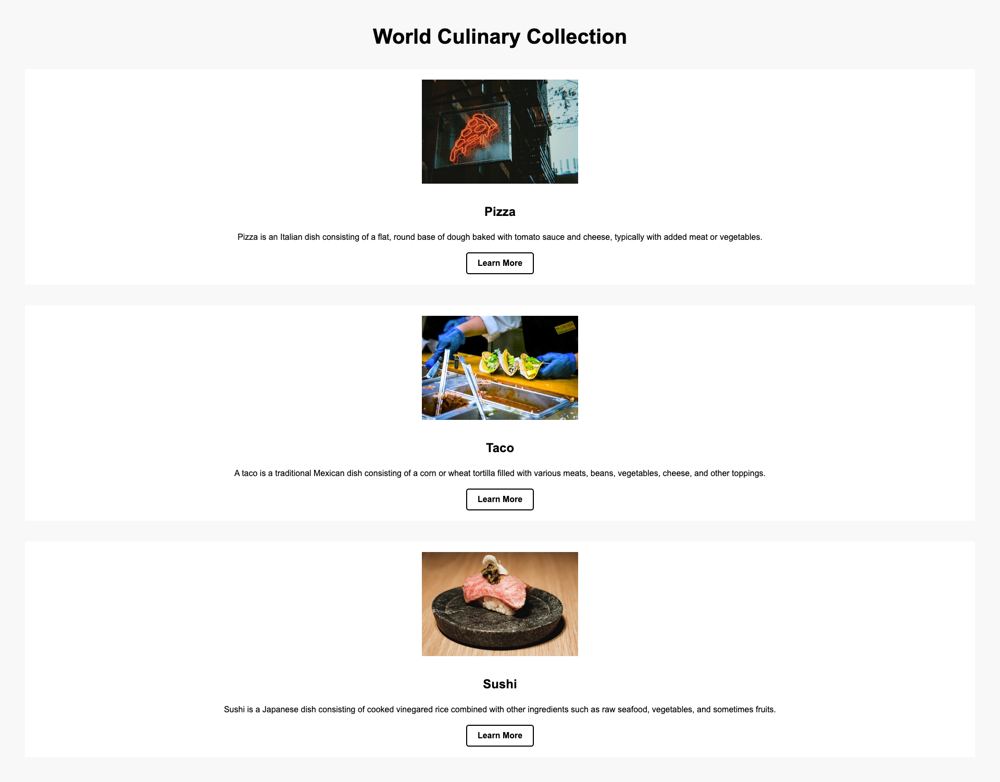

# HTML CSS World Culinary Food

### Objectives
* Able to create HTML with CSS page.
* Able to set title for HTML page.
* Able to use Container Element.
* Able to use Text Element.
* Able to use Image Element.
* Able to use Link Element.
* Able to set attributes class and id to HTML Element.
* Able to create CSS file and link with HTML file.
* Able to create inline style CSS.
* Able to create Tag style CSS. (Internal Stylesheet)
* Able to create separate CSS file. (External Stylesheet)
* Able to use CSS Selector to style HTML Element.
* Able to use ID style CSS Selector.
* Able to use Class style CSS Selector.
* Able to use pseudo-class CSS Selector.
* Able to use Attribute CSS Selector.

### Example Page

### Sample Data
1. Pizza: Pizza is an Italian dish consisting of a flat, round base of dough baked with tomato sauce and cheese, typically with added meat or vegetables. Picture url https://source.unsplash.com/random/300x200/?pizza, learn more https://en.wikipedia.org/wiki/Pizza.
2. Taco: A taco is a traditional Mexican dish consisting of a corn or wheat tortilla filled with various meats, beans, vegetables, cheese, and other toppings. Picture url https://source.unsplash.com/random/300x200/?taco, learn more https://en.wikipedia.org/wiki/Taco.
3. Sushi: Sushi is a Japanese dish consisting of cooked vinegared rice combined with other ingredients such as raw seafood, vegetables, and sometimes fruits. Picture url https://source.unsplash.com/random/300x200/?sushi, learn more https://en.wikipedia.org/wiki/Sushi.

